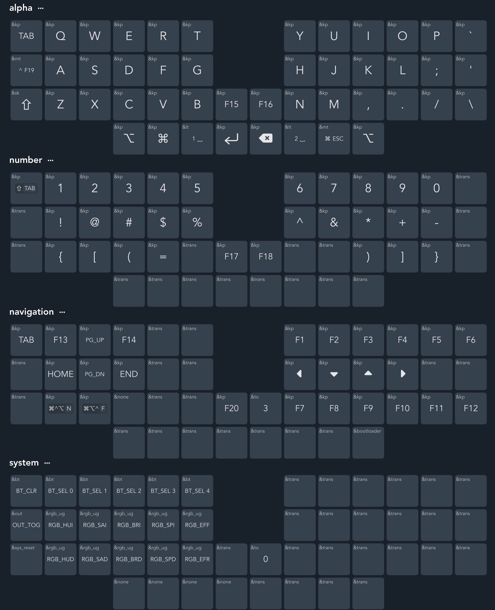

# zmk firmware config for Owl split keyboard
[Owl Split Keyboard](https://github.com/hza2002/owl) is a split keyboard based on Lily58, Crkbd, Sofle and Torn keyboards.

## Attention
- I referenced the configuration files of other keyboards in the zmk repository to write the firmware configuration for this keyboard, and used the [web](https://nickcoutsos.github.io/keymap-editor) provided from [nickcoutsos](https://github.com/nickcoutsos/keymap-editor) provided to modify key positions interactively. And then the keymap-editor robot automatically builds the firmware.
- The existing layout firmware can be found in [GitHub action]([Workflow runs · hza2002/zmk-config (github.com).
- Due to the **highly personalized layout** of my keyboard, I strongly recommend you refer to the [zmk documentation](https://zmk.dev/docs/user-setup), use the files in this repository to create a GitHub repository, and use GitHub Actions to build your own firmware.
## Current layout

